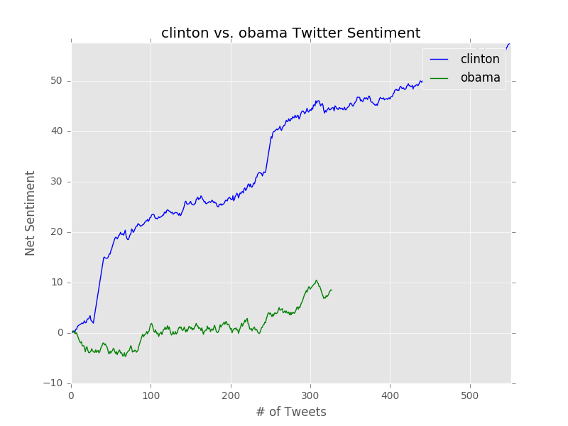

#COMSW3101 Fall 2016 Final Project: Twitter Sentiment Analysis

##Project Description
This project compares the Twitter sentiment of two different topics. Using the Tweepy library, it live streams tweets containing the keywords specified by the user, and plots the net sentiment of each topic using matplotlib. These plots are overlaid and updated live (using matplotlib animation) to allow for more direct comparison between both topics.

The goal of the project is to allow a user interested in two topics to compare the live tweet sentiment of both. Sentiment is influenced by many factors like current events, online interactions, media, etc. It can be interesting, for example, to compare the sentiment around two sports teams, which could be influenced by in-game injuries, scores, etc. By plotting live tweets, the program also allows users to look at differences in frequency.

It would be interesting to add machine learning functionality on twitter data to predict events based on the sentiment. Injuries on sports teams could be predicted based on changes in tweet sentiment during past injuries.

## Samples

+ NFL: As the Ravens play the Steelers, we see a sharp decline in sentiment about the Steelers plummets due to Quarterback Ben Roethlisberger's struggle to perform well after his return from injury.

## Project Dependencies
+ json: used for parsing data.
+ [matplotlib](www.matplotlib.org): used for creating plot and animating data.
+ [TextBlob](http://textblob.readthedocs.io/en/dev/index.html): used for sentiment analysis of Tweets.
+ [Tweepy](www.tweepy.org): used for accessing Twitter API.
+ [Numpy](www.numpy.org): Used for managing arrays  x/y coordinates.

#### Installation (OSX):
To install these libraries for Python 3, type 'pip3 install [name]'.

### Running the Project:
Once all the dependencies are installed, you can simply run 'python3 sentiment.py' in terminal.

## Extensions
+ Tapping into Twitter geo-data would add rich insights to the visualizations. For example, as it pertains to the U.S. elections, average sentiment of candidates or political topics could be overlaid onto a US map by state.

+ Allowing users to visualize multiple plots simultaneously, or a variable number of topics on a given plot (more customizations).
