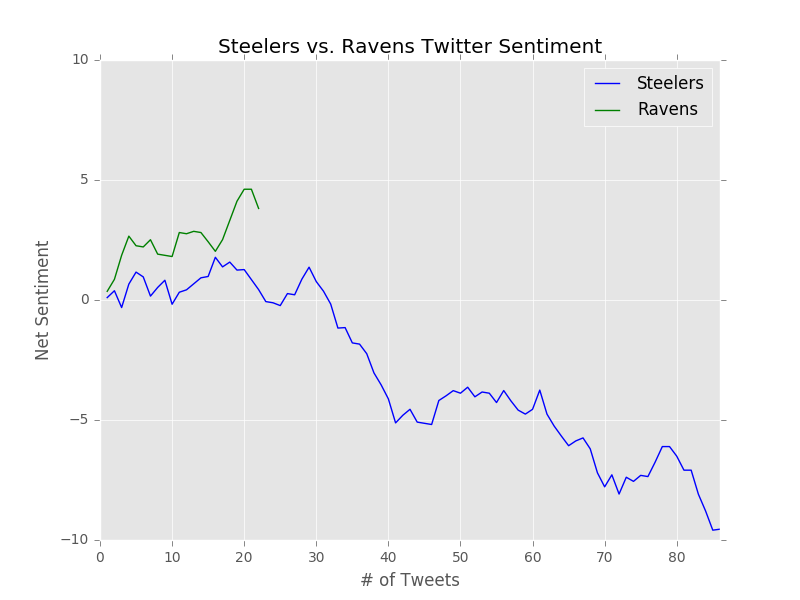
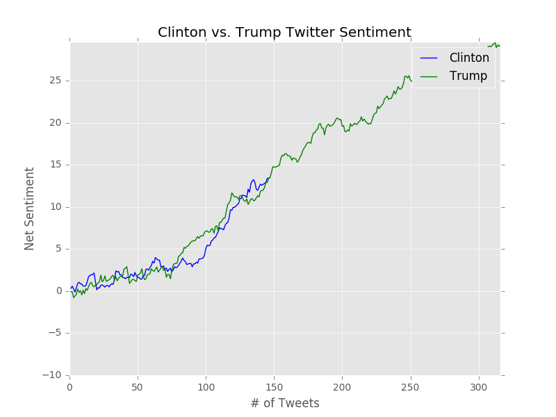
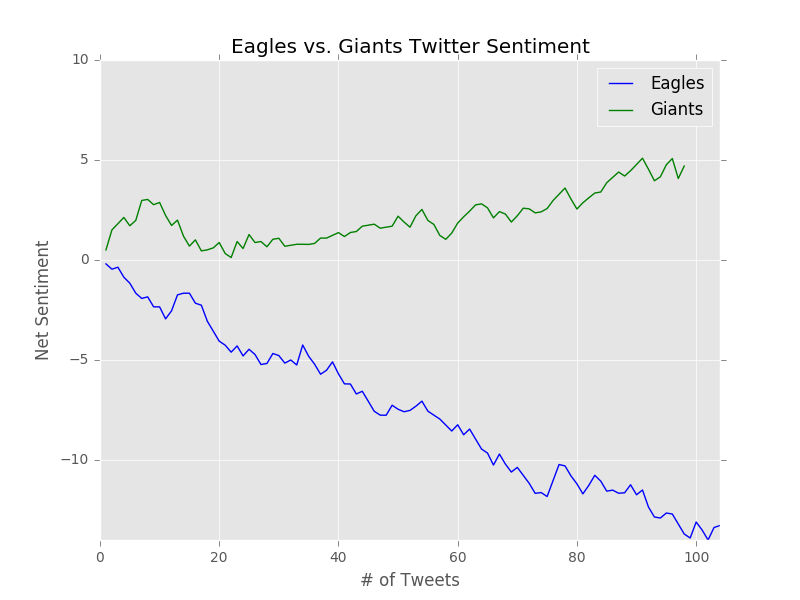

#COMSW3101 Fall 2016 Final Project: Twitter Sentiment Analysis

##Project Description
This project compares the Twitter sentiment of two different topics. Using the Tweepy library, it live streams tweets containing the keywords specified by the user, and plots the net sentiment of each topic using matplotlib. These plots are overlaid and updated live (using matplotlib animation) to allow for more direct comparison between both topics.

The goal of the project is to allow a user interested in two topics to compare the live tweet sentiment of both. Sentiment is influenced by many factors like current events, online interactions, media, etc. It can be interesting, for example, to compare the sentiment around two sports teams, which could be influenced by in-game injuries, scores, etc. By plotting live tweets, the program also allows users to look at differences in frequency.

## Samples

+ NFL/Injury: As the Ravens play the Steelers, we see a sharp decline in sentiment about the Steelers plummets due to Quarterback Ben Roethlisberger's struggle to perform well after his return from injury (failing expectations).

+ Politics: This was during Clinton's rally in Pennsylvania, which is reflected in very positive sentiment. Obama's sentiment, meanwhile, remained around net neutral.

+ Elections: Net sentiment around both candidates is about the same pre-election. Trump has consistently created conflict and turmoil with his comments, actions, and social media posts. The higher volume of tweets over a period of time is reflected by this. It is interesting to note that both candidates have net positive sentiment, despite having the lowest approval ratings of any candidates running for president in U.S. history. This might suggest something about how positive or negative biased tweets are, or how the objectivity of tweets factors into sentiment.

+ Winning/Losing: Here we see a clear discrepancy in sentiment between the losing team and winning team.

## Project Dependencies
+ json: used for parsing data.
+ [matplotlib](www.matplotlib.org): used for creating plot and animating data.
+ [TextBlob](http://textblob.readthedocs.io/en/dev/index.html): used for sentiment analysis of Tweets.
+ [Tweepy](www.tweepy.org): used for accessing Twitter API.
+ [Numpy](www.numpy.org): Used for managing arrays  x/y coordinates.

#### Installation (OSX)
To install these libraries for Python 3, type 'pip3 install [name]'.

### Running the Project
Once all the dependencies are installed, you can simply run 'python3 sentiment.py' in terminal.
Enter in the two topics you want to stream and the number of total tweets to stream.
A plot will open up and sentiment of both topics will be plotted until the tweet limit is hit.
+ NOTE: Twitter has streaming limits that may be hit. This will be printed to console.

## Outline of Code Structure
+ The figure and subplot are setup globally, along with other variable declarations (plot values, etc.).
+ In main, authorization is setup to allow use of Twitter API through Tweepy library.
+ The listener class allows for streaming of live tweets given StreamListener. This stream is filtered by the two topics which the user inputs. The user can also input the # of tweets to be streamed. The stream will be stopped after this limit is reached.
+ As tweets are streamed, each tweet is extracted and its sentiment is computed and added to the respective x/y value numpy arrays in on_data(). The tweets are also outputted to a file tweets.txt with the sentiment.
+ Note that sentiment is only considered if its objectivity is less than 0.2 (filtering out very objective tweets). It was interesting to play around with this, however I wasn't able to come to a consensus on filtering out objectivity vs subjectivity.
+ The animate_graph() function updates the newest x/y values on the plot, and also updates the scale of each of the axis as x/y values for each topic change.
+ Once the max number of tweets has been hit, the stream and animation are both stopped.

## Problems Encountered
+ There were some challenges with overlaying the sentiment of both topics onto the same subplot.
+ the on_data() function didn't just return tweet status, but also limits, deletions, etc. I had to make sure to properly filter out the tweet and handle when limits were hit.
+ There were numerous errors on reads when I streamed topics repetitively and hit limits. I would look other libraries for further developing this project or other future projects.

## Extensions
+ Tapping into Twitter geo-data would add rich insights to the visualizations. For example, as it pertains to the U.S. elections, average sentiment of candidates or political topics could be overlaid onto a US map by state.

+ Allowing users to visualize multiple plots simultaneously, or a variable number of topics on a given plot (more customizations).

+ It would be interesting to add machine learning functionality on twitter data to predict events based on the sentiment. Injuries on sports teams could be predicted based on changes in tweet sentiment during past injuries.
